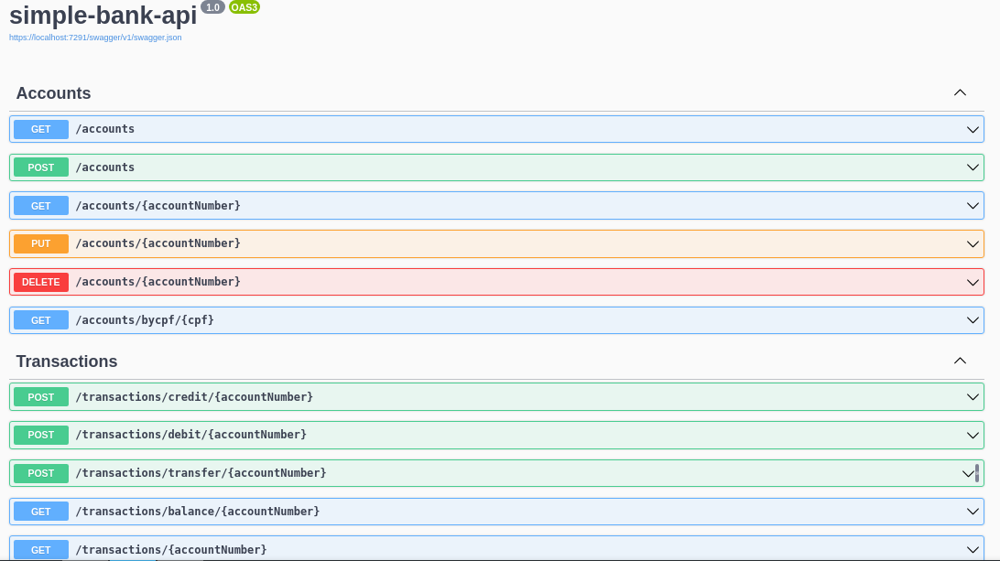

# Simple Bank API

#### API that simulates a simple bank developed in .NET



The frontend be available [in this repository](https://github.com/vitor-msp/simple-bank-front)

## Execution

1. Clone this repository
```
git clone https://github.com/vitor-msp/simple-bank-api.git
```

2. Access the downloaded folder
```
cd simple-bank-api/simple-bank-api
```

3. Restore the .NET dependencies
```
dotnet restore
```

4. Run migrations
```
dotnet ef database update
```

5. Run API
```
dotnet run
```

6. Access [Swager URL](http://localhost:5000/swagger)

## Notes

1. The port 5000 in your machine must be free